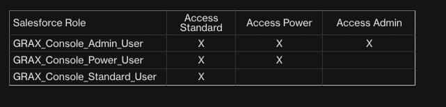
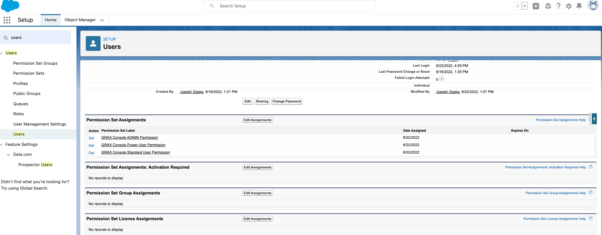

## No Salesforce Installation Required

### Step 1 : GRAX Backend

Below assumes you have GRAX deployed, setup, and running in [Self-managed](https://documentation.grax.io/docs/self-managed-install), [AWS Marketplace](https://aws.amazon.com/marketplace/pp/prodview-xgxs73bwfdzxu?sr=0-1&ref_=beagle&applicationId=AWSMPContessa), or [GRAX Managed](https://documentation.grax.io/docs/grax-aws-fully-managed-runtime-overview). If you need help setting up a backend you can email for a [trial@grax.com](mailto:trial@grax.com?subject=Need%20A%20Trial%20Setup) or current customers [help@grax.com](mailto:help@grax.com?subject=Help%20With%20Sandbox)

### Step 2 : Create Permission Sets

#### Adding Permission Sets 

1. Open Salesforce Developer Console
2. Debug 
3. Open Execute Anonymous window 
4. copy / paste 

```
PermissionSet pa = new PermissionSet(Name = 'GRAX_Console_Admin_User', Label = 'GRAX Console ADMIN Permission', Description='Grants users ADMIN permission(s) in the GRAX Console');
insert pa;

PermissionSet pp = new PermissionSet(Name = 'GRAX_Console_Power_User', Label = 'GRAX Console POWER Permission', Description='Grants users POWER USER permission(s) in the GRAX Console');
insert pp;

PermissionSet pu = new PermissionSet(Name = 'GRAX_Console_Standard_User', Label = 'GRAX Console Permission', Description='Grants users access to the GRAX Console');
insert pu;
```

5. click Execute:





### Step 3 : Add Permission Sets to User




### Step 3 : Go to GRAX Web Console