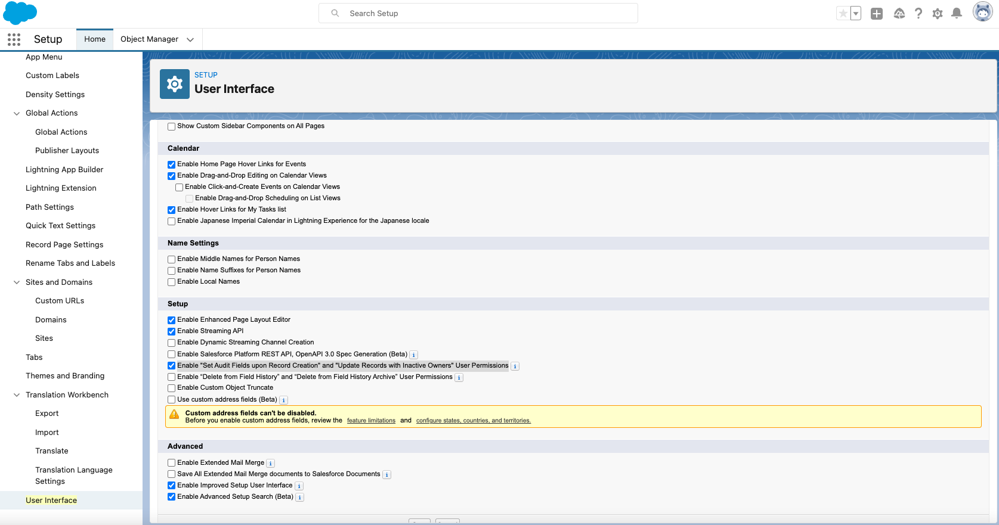
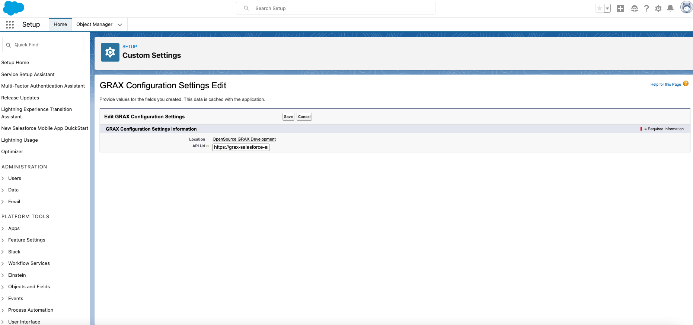
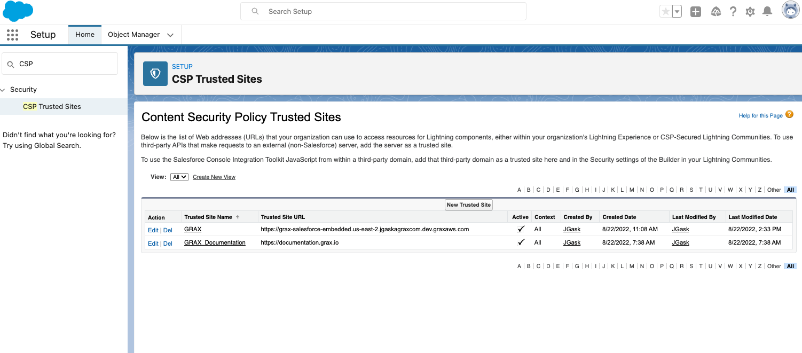
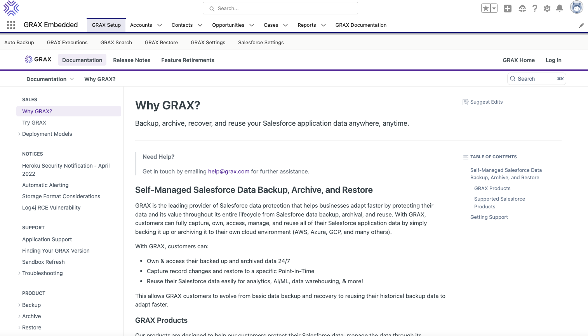

## Getting Started

### Step 1 : GRAX Backend

Below assumes you have GRAX deployed, setup, and running in [Self-managed](https://documentation.grax.io/docs/self-managed-install), [AWS Marketplace](https://aws.amazon.com/marketplace/pp/prodview-xgxs73bwfdzxu?sr=0-1&ref_=beagle&applicationId=AWSMPContessa), or [GRAX Managed](https://documentation.grax.io/docs/grax-aws-fully-managed-runtime-overview). If you need help setting up a backend you can email for a [trial@grax.com](mailto:trial@grax.com?subject=Need%20A%20Trial%20Setup) or current customers [help@grax.com](mailto:help@grax.com?subject=Help%20With%20Sandbox)

### Step 2 : GRAX UI for Salesforce

Below assumes you have knowledge of Salesforce Development, SFDX, and release procedures. If you need more information please refer to [documentation](./DEVELOPMENT.md#documentation--help).

1. Open Terminal or Cmd Line

2. Update SFDX - Update and validate SFDX is installed properly.
   ```
   sfdx update
   ```

3. Clone Repo 
   ```
   git clone https://github.com/graxinc/grax-salesforce-embedded.git
   cd grax-salesforce-embedded
   ```

4. Login to Salesforce. First log in thru your web browser, then the authorize the Salesforce CLI:

    ```
       sfdx auth:web:login -a GRAXDev -r https://test.salesforce.com
    ``` 

4. Enable "Set Audit Fields upon Record Creation" and "Update Records with Inactive Owners" User Permissions
    If you do not do this pushing the permission sets will fail.

    ```
    sfdx force:org:open -u GRAXDev -p /lightning/setup/UserInterfaceUI/home
    ```
    

5. Pushing GRAX To Sandbox OR Scratch Org
   - Pushing to a Sandbox - Recommended for testing

       ```
       sfdx force:source:deploy -p force-app/main/default -u GRAXDev
       ```
   - Create & Push to Scratch Org - Please refer to how to utilize [Salesforce Scratch Orgs](https://developer.salesforce.com/docs/atlas.en-us.sfdx_dev.meta/sfdx_dev/sfdx_dev_scratch_orgs.htm)
       ```
       sfdx force:org:create --definitionfile config/project-scratch-def.json --durationdays 30 --setalias GRAXDev -v DevHub
       sfdx force:user:password:generate -u GRAXDev
       sfdx force:source:push -u GRAXDev
       ```

### Step 3 : Configure & Go

1. GRAX Configuration Settings - Click "Manage" Button on "GRAX Configuration Settings" (GRAXConfiguration__c object)
    ```
    sfdx force:org:open -u GRAXDev -p /lightning/setup/CustomSettings/home
    ```
    

2. Add CSP Trusted Site - Click "New Trusted Site"
        Name:               GRAX
        Trusted Site URL:   https://grax-application-url.aws.azure.gcp.grax.com (Sample)

    ```
    sfdx force:org:open -u GRAXDev -p /lightning/setup/SecurityCspTrustedSite/home
    ```
    

Select the following directives:

  - Allow site for connect-src
  - Allow site for font-src
  - Allow site for frame-src
  - Allow site for frame-src
  - Allow site for img-src
  - Allow site for media-src
  - Allow site for style-src

3. Permission Set Assignments - Add All GRAX Permission Sets (to Admin User). Ensure "GRAX_Integration_Running_User" permission set is assigned to the user GRAX is running as.
    ```
    sfdx force:org:open -u GRAXDev -p /lightning/setup/ManageUsers/home
    ```    
    

4. Ready to go - Auto Backup >> Enabled
    ```
    sfdx force:org:open -u GRAXDev -p /lightning/n/GRAXEmbedSetup
    ```    
    

